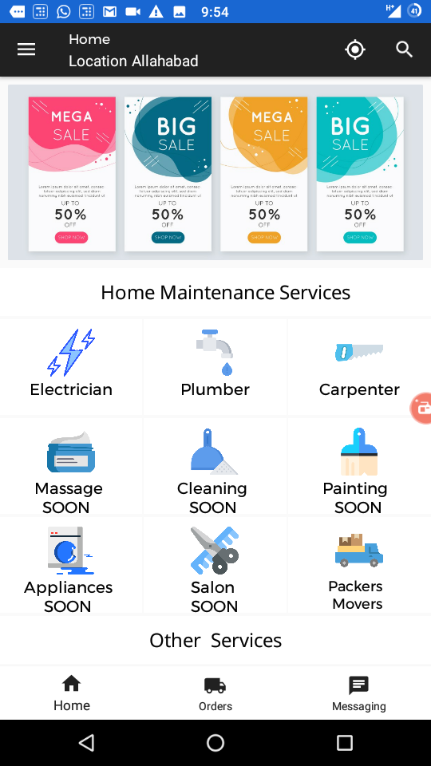
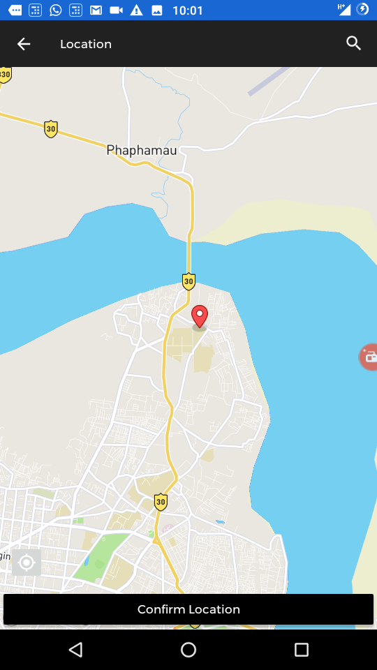
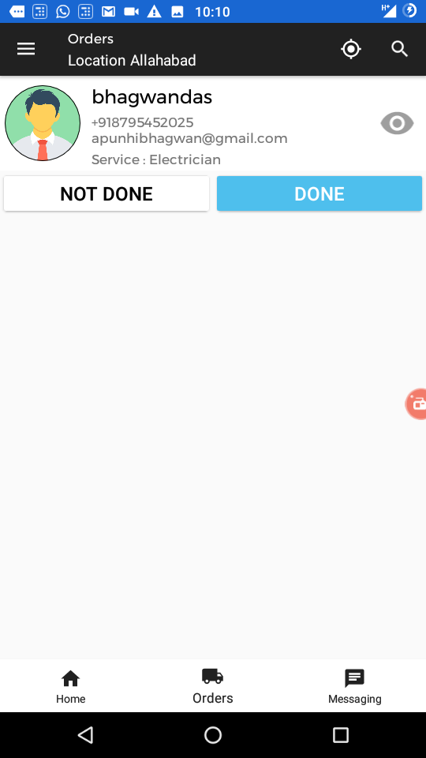
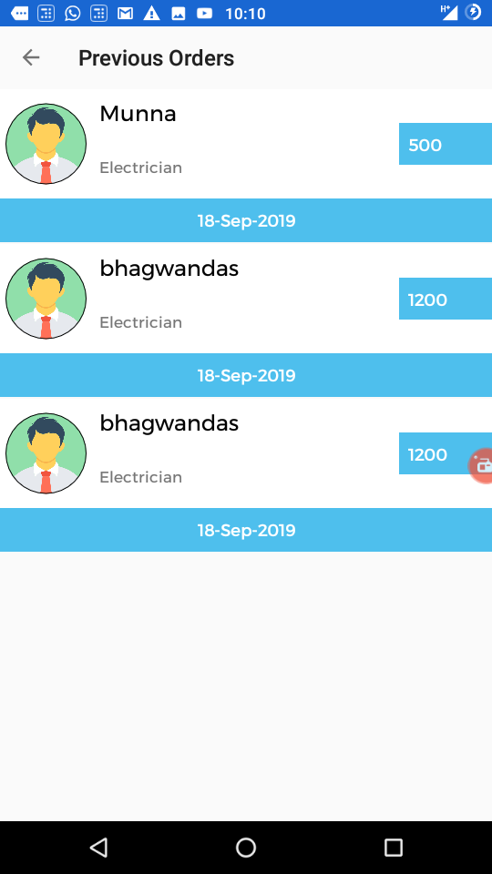
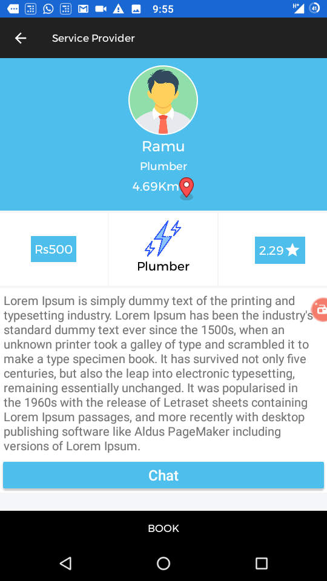

# House Assist
App focus on finding home related services in nearby location.
### Technologies Used
Java, Android, FireBase, MapBox.
 ### Features  
 * User can register both as a customer or as a utility provider
 * Interactive Map
 * Chat rooms
### Screenshots
<table>
  <tr>
    <td>
    <td>
     <td>
   <tr>
     <tr>
       <td>
    <td>
     <td>
   <tr>
<table>
  
  ### Contributors
  * [Rajat](https://github.com/991rajat)
  * [Sanyam](https://github.com/sanyamsinghal)
  * [Vijay](https://github.com/vijayprakashgautam)
     

